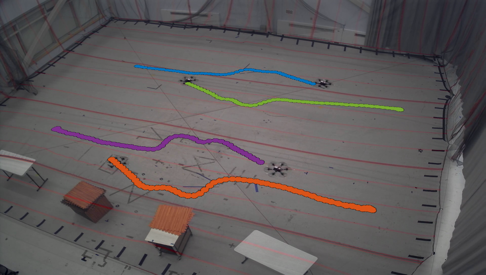

# Video Overlay Tool



### Overview
Inputs:
- ROS bag file with several vehicles' trajectories (on `/<veh_name>/pose` topics)
- video from a stationary camera
- homography matrix btwn camera plane and **planar** vehicle pose frame

Outputs:
- video with trajectories overlayed on the stationary camera's stream

### Instructions
Clone the repo, `catkin_make`, then:

```
roslaunch video_overlay video_overlay_node.launch experiment:=4_hexes_parallel_swaps_1_pass
```

Set/update the args in `video_overlay_node.launch` to point to the correct yaml files (homography, experiment)

If you don't have a homography matrix already, you should:
- find a recognizable moment in your video & take a screenshot
- find the corresponding vicon coordinates during that moment (from the bag)
- Click on the corresponding vehicle positions in the screenshot, using:
```
rosrun video_overlay video_overlay_node <screenshot_filename>
```
- Create a new `.yaml` file in `config/homography_pts` with the vicon and img coords
- Switch which `.yaml` file is loaded in the launch file
- Your homography matrix will be computed for you at the start of the script

The `outcpp.avi` file will be giant. You can compress it with ffmpeg (increase -crf to make file smaller):
```
ffmpeg -i outcpp.avi -crf 25 outcpp_small.avi
```

Contact: mfe@mit.edu
